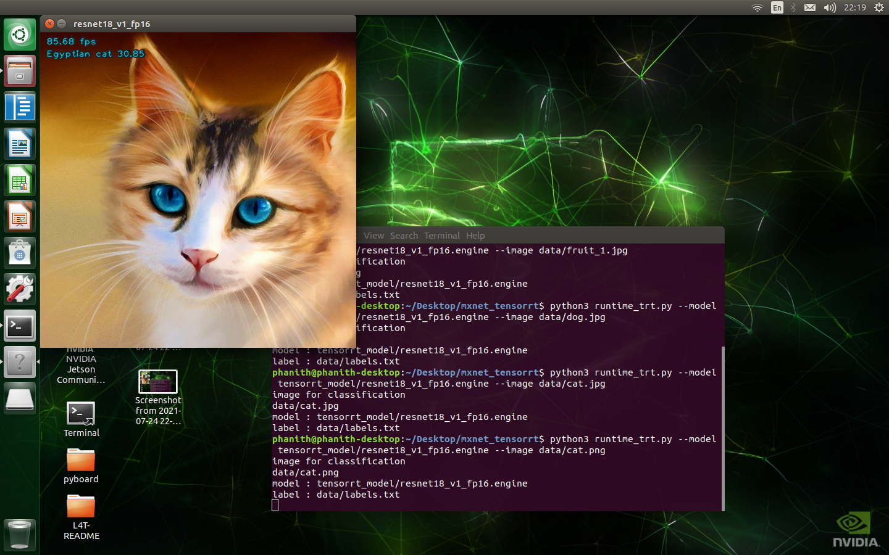

Deploying Mxnet model to TensorRT on Jetson Nano
====================================

 The models are sourced from the **[MXNET Gluon Model Zoo](https://mxnet.apache.org/versions/1.8.0/api/python/docs/api/gluon/model_zoo/index.html)**.The repository using NVIDIA **[TensorRT](https://developer.nvidia.com/tensorrt)** for deploying deep learning model mxnet onto the embedded Jetson Nano platform, improving performance by optimizations from onnx model convert from mxnet, FP32 and FP16 precision.we will guide you inference and real-time with CPU, GPU, FP32 and FP16 and fine-tune from pre-train **[ImageNet](https://image-net.org/)**.

### Table of Contents

* [Setup](#setup)
* [Download and Convert to ONNX model](#download-and-convert-to-onnx-model)
* [Build TensorRT Engine FP16 and FP32](#build-tensorrt-engine-fp16-and-fp32)
* [Inference with cpu and gpu](#inference-with-cpu-and-gpu)
* [Inference with tensorrt](#inference-with-tensorrt)
* [Result Inference Model](#result-inference-model)
* [Fine tuning custom dataset and deploy](#fine-tuning-custom-dataset-and-deploy)
* [Fine tuning on google colab](#fine-tuning-on-google-colab)

## Setup
-----

1. First time Jetson Nano once your device has been flashed with JetPack or setup with the pre-populated [SD Card Image](https://developer.nvidia.com/embedded/learn/get-started-jetson-nano-devkit#write). Jetpack that I test with is Jetpack 4.5.1 include: CUDA=10.2, OPENCV=4.1.1, TensorRT=7.1, cuDNN 8.0 was pre-install on this SD Card Image.
2. Clone this repository

        cd ~
        git clone https://github.com/SokPhanith/jetson_nano_mxnet_tensorrt.gi
        cd jetson_nano_mxnet_tensorrt/install

3. CUDA toolkit related paths are not set in the environment variables fix that by run :

        ./install_basics.sh

4. Install mxnet pre-build on Jetson Nano 

        ./install.sh

5. Install pycuda on Jetson Nano

        ./install_pycuda.sh
6. Add more swap memory on jetson nano by default 2GB

        sudo systemctl disable nvzramconfig
        sudo fallocate -l 6G /mnt/6GB.swap
        sudo mkswap /mnt/6GB.swap
        sudo swapon /mnt/6GB.swap
        sudo reboot

## Download and Convert to ONNX model
-----

First Download pre-train ImageNet dataset Image classification from sourced from the **[MXNET Gluon Model Zoo](https://mxnet.apache.org/versions/1.8.0/api/python/docs/api/gluon/model_zoo/index.html)** by my python file just give a name model from those link will download, save checkpoint epoch in folder pretrain_model and convert to **[ONNX](https://github.com/onnx/onnx)** model format in folder onnx_model

        cd ~
        cd jetson_nano_mxnet_tensorrt
        python3 downlaod_convert.py resnet18_v1
        
# Out of Memory
 
For vgg11, vgg11_bn, vgg13, vgg13_bn, vgg16, vgg16_bn, vgg19, vgg19_bn download, save checkpoint epoch will no issues but when convert to onnx format model on jetson nan will not enough memory, so I have a notebook on folder colab name **mxnet_convert_onnx.ipynb**. That notebook guide you how to download pre-train, save checkpoint epoch and convert onnx model on google colab Free GPU just follow step by step. Click it by [Getting Start](https://colab.research.google.com/drive/1h1vWVw4VQlXY-xVCyYBxwF1KuyDB0cvK) or go to google colab upload my notebook and then go forward.

maximum performance by running these commands

	sudo nvpmodel -m 0
	sudo jetson_clocks

## Result Inference Model

Inference with a simple image cat.jpg 900x675 resolution
|     MODEL    |   FP16  |   FP32  |   GPU   |   CPU  |
|:-------------:|:-------:|:--------:|:--------:|:-------:|
| ------- | ----- | --- | ------- | ------- |

