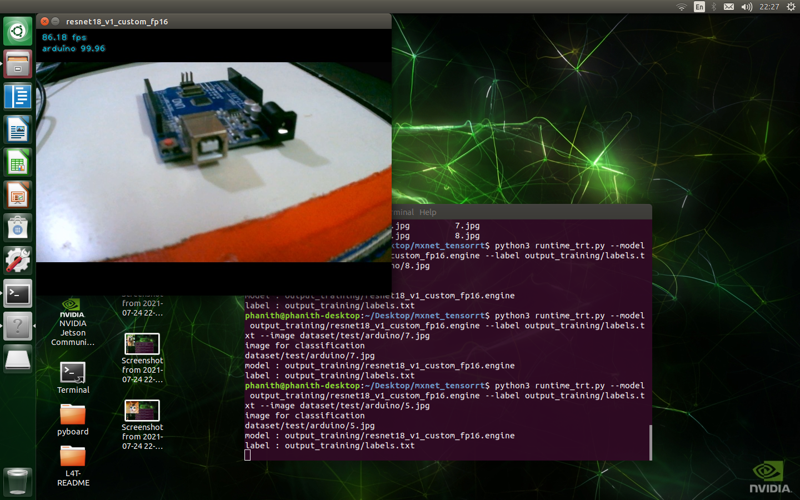
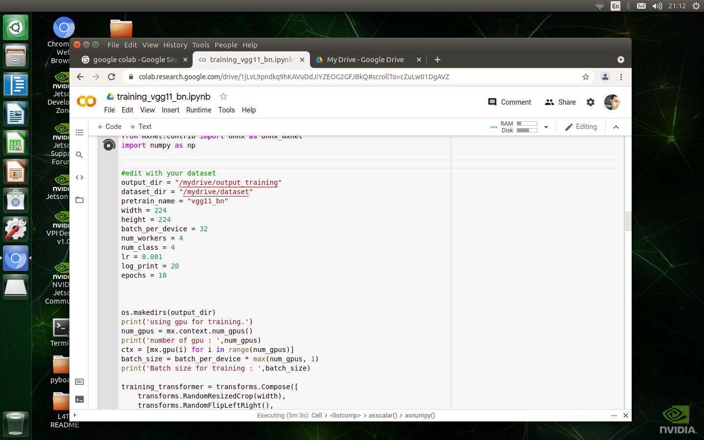
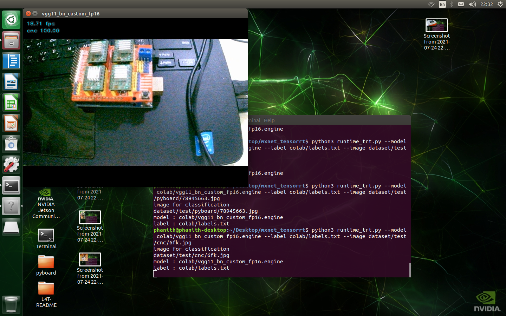

Deploying Mxnet model to TensorRT on Jetson Nano
====================================

 The models are sourced from the **[MXNET Gluon Model Zoo](https://mxnet.apache.org/versions/1.8.0/api/python/docs/api/gluon/model_zoo/index.html)**.The repository using NVIDIA **[TensorRT](https://developer.nvidia.com/tensorrt)** for deploying deep learning model mxnet onto the embedded Jetson Nano platform, improving performance by optimizations from onnx model convert from mxnet, FP32 and FP16 precision.we will guide you inference and real-time with CPU, GPU, FP32 and FP16 and fine-tune from pre-train **[ImageNet](https://image-net.org/)**.

### Table of Contents

* [Setup](#setup)
* [Download and Convert to ONNX model](#download-and-convert-to-onnx-model)
* [Build TensorRT Engine FP16 and FP32](#build-tensorrt-engine-fp16-and-fp32)
* [Inference with cpu and gpu](#inference-with-cpu-and-gpu)
* [Inference with tensorrt](#inference-with-tensorrt)
* [Result Inference Model](#result-inference-model)
* [Fine tuning custom dataset and deploy](#fine-tuning-custom-dataset-and-deploy)
* [Fine tuning on google colab](#fine-tuning-on-google-colab)

## Setup
-----

1. First time Jetson Nano once your device has been flashed with JetPack or setup with the pre-populated [SD Card Image](https://developer.nvidia.com/embedded/learn/get-started-jetson-nano-devkit#write). Jetpack that I test with is Jetpack 4.5.1 include: CUDA=10.2, OPENCV=4.1.1, TensorRT=7.1, cuDNN 8.0 was pre-install on this SD Card Image.
2. Clone this repository

        cd ~
        git clone https://github.com/SokPhanith/jetson_nano_mxnet_tensorrt.gi
        cd jetson_nano_mxnet_tensorrt/install

3. CUDA toolkit related paths are not set in the environment variables fix that by run :

        ./install_basics.sh

4. Install mxnet pre-built, onnx and onnxruntime on Jetson Nano 

        ./install.sh

5. Install pycuda on Jetson Nano

        ./install_pycuda.sh
	
6. Add more swap memory on jetson nano by default 2GB

        sudo systemctl disable nvzramconfig
        sudo fallocate -l 6G /mnt/6GB.swap
        sudo mkswap /mnt/6GB.swap
        sudo swapon /mnt/6GB.swap
        sudo reboot
	
## Download and Convert to ONNX model
-----

First Download pre-train ImageNet dataset Image classification from sourced from the **[MXNET Gluon Model Zoo](https://mxnet.apache.org/versions/1.8.0/api/python/docs/api/gluon/model_zoo/index.html)** by my python file just give a name model from those **[link](https://mxnet.apache.org/versions/1.8.0/api/python/docs/api/gluon/model_zoo/index.html)** will download, save checkpoint epoch  0 in folder pretrain_model and convert to **[ONNX](https://github.com/onnx/onnx)** model format in folder onnx_model

        cd ~
        cd jetson_nano_mxnet_tensorrt
        python3 downlaod_convert.py resnet18_v1
        
# Out of Memory Some Model
 
For vgg11, vgg11_bn, vgg13, vgg13_bn, vgg16, vgg16_bn, vgg19, vgg19_bn download, save checkpoint epoch  0 will no issues but when convert to onnx format model on jetson nano will not enough memory, so I have a notebook on folder colab name **mxnet_convert_onnx.ipynb**. That notebook guide you how to download pre-train ImageNet, save checkpoint epoch  0 and convert onnx model on google colab Free GPU just follow step by step. Click it by **[Getting Start](https://colab.research.google.com/drive/1h1vWVw4VQlXY-xVCyYBxwF1KuyDB0cvK)** or go to **[Google Colab](https://colab.research.google.com/#create=true)** upload my notebook and then go forward, it's will downlaod onnx model format.

## Build TensorRT Engine FP16 and FP32
-----

Afte you have a onnx model format at folder onnx_model, you can start build TensorRT model engine for runtime. Jetson Nano support Only FP16 and FP32 precision and Fastest model is FP16 precision. you can build model using like 

**FP32**

	python3 build_tensorrt.py --model onnx_model/resnet18_v1.onnx
	
**FP16**

	python3 build_tensorrt.py --model onnx_model/resnet18_v1.onnx --fp16

## Inference with cpu and gpu
-----

When you run download_and_convert.py will save pre-train model mxnet on folder name pretrain_model, About labels.txt for ImageNet in data folder, you can path to inference with a single image or csi or webcam or video. One thing very important is epoch that you export to save by default from ImageNet pre-train is 0. If you fine tuning with custom dataset different epoch you must change number of epoch while you export save checkpoint mxnet model.

**Maximum Performance**

	sudo nvpmodel -m 0
	sudo jetson_clocks

**RaspberryPi Camera V2 GPU**

	python3 runtime_simple.py --model pretrain_model/resnet18_v1 --epoch 0 --csi

**RaspberryPi Camera V2 CPU**

	python3 runtime_simple.py --model pretrain_model/resnet18_v1 --epoch 0 --csi --cpu
		
**A Single Image**

	python3 runtime_simple.py --model pretrain_model/resnet18_v1 --epoch 0 --image data/dog.jpg

**Webcam**

	python3 runtime_simple.py --model pretrain_model/resnet18_v1 --epoch 0 --webcam 0

**Video**

	python3 runtime_simple.py --model pretrain_model/resnet18_v1 --epoch 0 --video data/jellyfish.mkv

## Inference with tensorrt
-----

while you build tensorrt engine model will saved at folder tensorrt_model. Runtime with tensorrt no need a number of epoch that export save because tensorrt was build from onnx model format.

**Maximum Performance**

	sudo nvpmodel -m 0
	sudo jetson_clocks

**FP16 and a Single Image**

	python3 runtime_trt.py --model tensorrt_model/resnet18_v1_fp16.engine --image data/dog.jpg
	
**FP32 and a Single Image**

	python3 runtime_trt.py --model tensorrt_model/resnet18_v1_fp32.engine --image data/dog.jpg
		
**Webcam**

	python3 runtime_trt.py --model tensorrt_model/resnet18_v1_fp16.engine --webcam 0 

**Video**

	python3 runtime_trt.py --model tensorrt_model/resnet18_v1_fp16.engine --video data/jellyfish.mkv

**RaspberryPi Camera V2**

	python3 runtime_trt.py --model tensorrt_model/resnet18_v1_fp16.engine --csi

**Note** : inception_v3 input shape 299x299 when you inference, save epoch checkpoint and build tensorrt engine make sure input shape 299x299

## Result Inference Model
-----

Inference with a single image data/dog.jpg 365x480 resolution

|     MODEL    |   FP16  |   FP32  |   GPU   |   CPU  |
|:------------:|:-------:|:-------:|:-------:|:------:|
| resnet18_v1| 85.8FPS | 51.2FPS | 28.3FPS | 4.4FPS |
| resnet34_v1| 49.2FPS | 28.8FPS | 15.9FPS | 2.4FPS |
| resnet50_v1| 35.9FPS | 20.0FPS | 10.7FPS | 2.1FPS |
| resnet101_v1| 20.2FPS | 11.3FPS | 6.0FPS | 1.2FPS |
| resnet152_v1| 14.3FPS | 7.8FPS | 4.1FPS | 0.8FPS |
| resnet18_v2| 79.2FPS | 49.4FPS | 28.0FPS | 4.4FPS |
| resnet34_v2| 45.3FPS | 27.9FPS | 15.8FPS | 2.4FPS |
| resnet50_v2| 28.8FPS | 17.0FPS | 10.7FPS | 2.1FPS |
| resnet101_v2| 17.0FPS | 10.0FPS | 6.2FPS | 1.2FPS |
| resnet152_v2| 11.9FPS | 7.0FPS | 4.3FPS | 0.8FPS |
| densetnet121 | 33.1FPS | 21.9FPS | 8.9FPS | 1.9FPS |
| densetnet161 | 13.3FPS | 8.2FPS | 4.3FPS | 0.9FPS |
| densetnet169 | 26.2FPS | 17.2FPS | 6.9FPS | 1.5FPS |
| densetnet201 | 20.0FPS | 13.1FPS | 5.5FPS | 1.2FPS |
| densetnet201 | 20.0FPS | 13.1FPS | 5.5FPS | 1.2FPS |
| mobilenet0_25 | 295FPS | 284FPS | 66FPS | 22FPS |
| mobilenet0_5 | 165FPS | 160FPS | 60FPS | 12FPS |
| mobilenet0_75 | 106FPS | 97.9FPS | 38.5FPS | 7.2FPS |
| mobilenet1_0 | 78.6FPS | 68.4FPS | 28.5FPS | 5.3FPS |
| mobilenet_v2_0_25 | 198FPS | 185FPS | 58.0FPS | 15.0FPS |
| mobilenet_v2_0_5 | 127FPS | 119FPS | 47.0FPS | 8.2FPS |
| mobilenet_v2_0_75 | 88.3FPS | 84.2FPS | 33.4FPS | 6.2FPS |
| mobilenet_v2_1_0 | 70.7FPS | 66.6FPS | 25.8FPS | 4.5FPS |
| vgg11 | 17.4FPS | 10.5FPS | 7.2FPS | 0.9FPS |
| vgg11_bn | 18.5FPS | 11.2FPS | 7.0FPS | 0.9FPS |
| vgg13 | 13.2FPS | 7.7FPS | 5.2FPS | 0.7FPS |
| vgg13_bn | 13.2FPS | 7.9FPS | 5.0FPS | 0.6FPS |
| vgg16 | 10.8FPS | 6.3FPS | 4.1FPS | 0.5FPS |
| vgg16_bn | 10.8FPS | 6.3FPS | 4.0FPS | 0.5FPS |
| vgg19 | 9.0FPS | 5.3FPS | 3.4FPS | 0.5FPS |
| vgg19_bn | 9.1FPS | 5.2FPS | 3.3FPS | 0.5FPS |
| squeezenet1_0 | - | - | 35.5FPS | 7.2FPS |
| squeezenet1_0 | 206FPS | 136.7FPS | 61.2FPS | 13.0FPS |
| alexnet | 67.3FPS | 44.0FPS | 33.5FPS | 4.1FPS |
| inception_v3 | 22.1FPS | 12.1FPS | 6.0FPS | 1.3FPS |

## Fine tuning custom dataset and deploy
-----

You can prepare your own custom dataset by my python file camera_tool.py.This tool will take a image from Webcam or Raspberrypi camera v2. Fisrt you must have a labels.txt file that show you that, The label file one class label per line and is alphabetized too(Very important so the order of the classes in the label file matches the order of the corresponding subdirectories on jetson nano).

	- labels.txt
		- arduino
		- cnc
		- esp8266
		- pyboard
		
After then run a tool to cllecting Data by 

**Raspberrypi Camera V2**
	
	python3 camera_tool.py --dataset_dir board --label labels.txt --csi

**Webcam**
	
	python3 camera_tool.py --dataset_dir board --label labels.txt --webcam 0

q for exit - s for save - c for change class - d for change folder train/valid/test
you will get in folder board directory have 3 folder dataset train/valid/test and 4 class folder per train/valid/test

	- board
		- train
			- arduino
			- cnc
			- esp8266
			- pyboard
		- valid
			- arduino
			- cnc
			- esp8266
			- pyboard
		- test
			- arduino
			- cnc
			- esp8266
			- pyboard
Start fine-tuning with resnet18_v1 only last layer of model by load pre-train ImageNet dataset

	python3 train.py --model resnet18_v1 --dataset_dir board/ --output_dir output_training - num_class 4 --epoch 5 --lr 0.001 --batch_per_device 8
	
**Build TensorRT Engine**

	python3 build_tensorrt.py --model output_training/resnet18_v1_custom.onnx
	python3 build_tensorrt.py --model output_training/resnet18_v1_custom.onnx --fp16
	
**Inference GPU And CPU**

	python3 runtime_simple.py --model output_training/resnet18_v1_custom  --epoch 5 --image board/test/arduino/1.jpg --label output_training/labels.txt
	python3 runtime_simple.py --model output_training/resnet18_v1_custom  --epoch 5 --image board/test/arduino/1.jpg --label output_training/labels.txt --cpu

**Inference TensorRT FP16 And FP32**

	python3 runtime_trt.py --model output_training/resnet18_v1_custom_fp16.engine --label output_training/labels.txt --image board/test/arduino/1.jpg 
	python3 runtime_trt.py --model output_training/resnet18_v1_custom_fp32.engine --label output_training/labels.txt --image board/test/arduino/1.jpg 

**Note** : inception_v3 input shape 299x299 when you fine tune you must set input 299x299.

**Example inference with image resnet18_v1 model custom dataset**

**Example inference with Raspberrypi Camera V2**

## Fine tuning on google colab
-----

If you want Fine tuning with big model like : vgg11, vgg11_bn, vgg13, vgg13_bn, vgg16, vgg16_bn, vgg19, vgg19_bn jetson nano can't not Fine tuning because out of memory but you can fine tuning on google colab FREE GPU. I prepare notebook for fine tuning in folder colab **training_vgg11_bn.ipynb** with vgg11_bn model, guide you install mxnet, onnx on google colab and connect with google drive for save output training. First Prepare custom dataset like above **Fine tuning custom dataset and deploy** and rename folder to dataset compress to dataset.zip and then upload to google drive.

	- dataset
		- train
			- arduino
			- cnc
			- esp8266
			- pyboard
		- valid
			- arduino
			- cnc
			- esp8266
			- pyboard
		- test
			- arduino
			- cnc
			- esp8266
			- pyboard
	- Make dataset folder became dataset.zip upload your google drive.
Let's start fine tuning by click **[Getting Start](https://colab.research.google.com/drive/18LXCd3nR8y5q-8khhDh1j2gkeIMJT8Ef)** or go to google colab upload my notebook and then go forward just make some edit on this point : 

	You must edit : pretrain_name = 'vgg11_bn' 
			num_class = 4

**Note** : inception_v3 input shape 299x299 when you fine tune you must set input 299x299.

	
**Example inference with image vgg11_bn model custom dataset**

# References
 - [tensorrt_demos](https://github.com/jkjung-avt/tensorrt_demos)
 - [MXNET Gluon Model Zoo](https://mxnet.apache.org/versions/1.8.0/api/python/docs/api/gluon/model_zoo/index.html)
